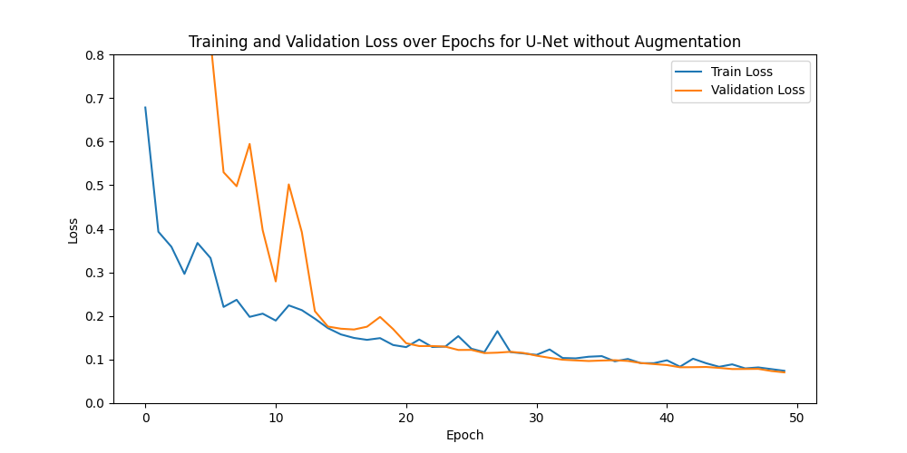
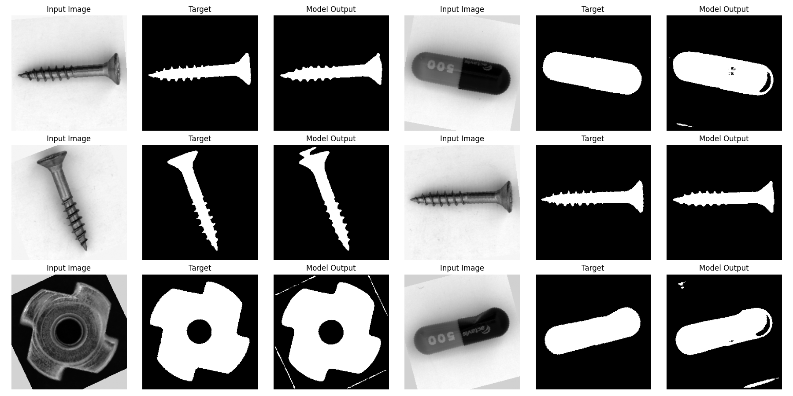
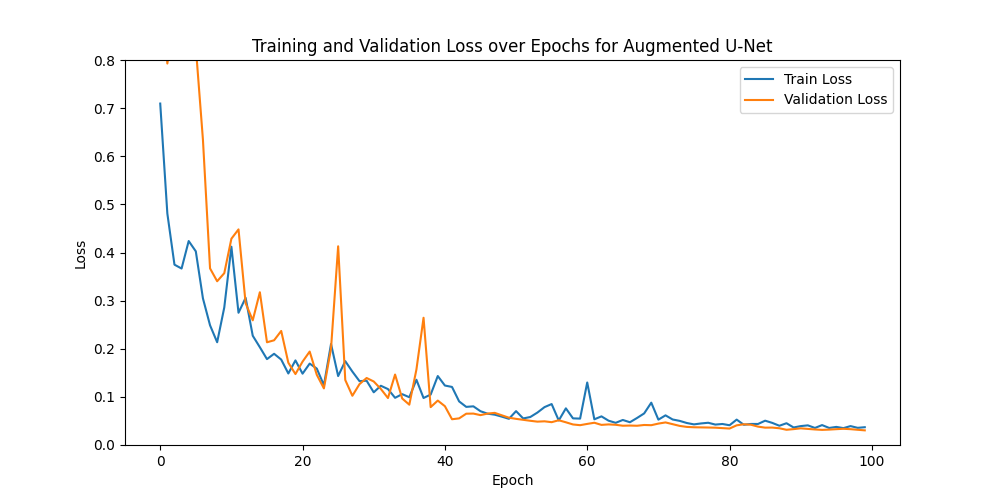
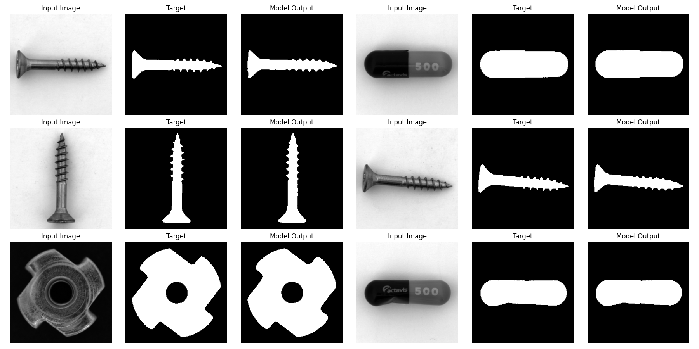
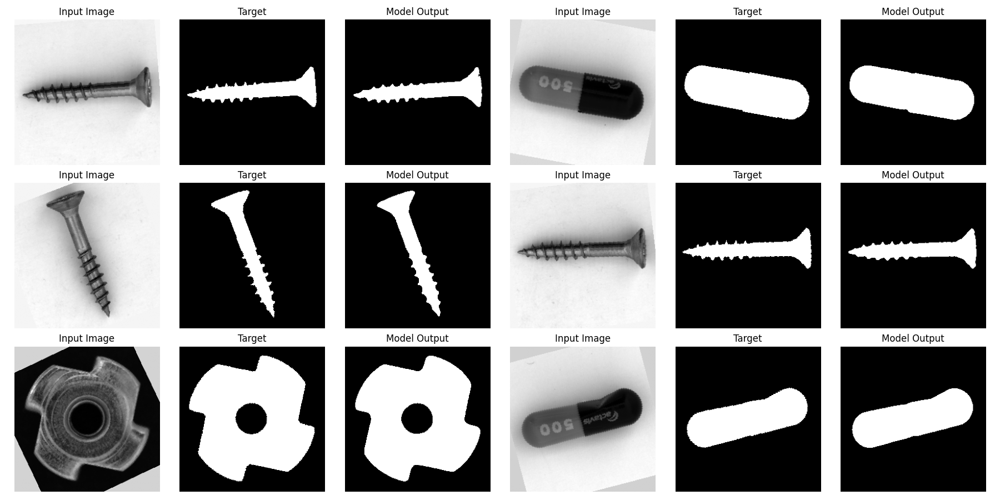

---
title: "Project 5 - CNN-Based Binary Segmentation"
author:
  - name: Christopher Lehner
    affiliations:
      - name: Faculty IM, OTH Regensburg
date: 2026-6-29
format:
  html:
    theme: cosmo
    toc: true
    toc-depth: 3
  pdf:
    documentclass: scrartcl
---

# 1. Goal & Motivation

In modern industrial environments, the optical inspection and analysis of objects is a critical task for ensuring quality and efficiency. A fundamental step in this process is the accurate binary segmentation of objects from their backgrounds in images. This is then used for further analysis, such as defect detection, measurement, or classification.

Classical image segmentation algorithms such as Otsu's method or watershed segmentation are computationally efficient, but are very sensitive to varying illumination and reflections, since they primarily rely on pixel intensity values without understanding global and local context.

To overcome these limitations, this project aims to implement a Convolutional Neural Network (CNN)-based approach for binary segmentation, specifically utilizing the U-Net architecture, which has demonstrated significant success in various segmentation tasks. The U-Net's encoder decoder structure with skip connections allows it to effectively capture both local and global context, making it wellsuited for the challenges presented by industrial object segmentation.

The primary goals of this project are to implement a U-Net architecture using the PyTorch framework and to evaluate its performance on a relevant dataset.

# 2. Theory
In this section, we will cover the theoretical foundations of CNNs and the U-Net architecture, which is specifically designed for image segmentation tasks. We will also discuss the loss functions commonly used in binary segmentation tasks.

## 2.1 Convolutional Neural Networks (CNNs)
CNNs are specialized for processing gridlike data by using learnable filters to capture spatial structures. The key building blocks used in this project are:

* **Convolutional Layers:** Extract local features such as edges and textures. A filter slides over the input in steps (stride), where a stride of 1 moves one pixel at a time and larger strides skip pixels, reducing the output size. Padding keeps spatial dimensions intact.
* **Batch Normalization:** Stabilizes training by normalizing layer outputs, ensuring consistent distributions throughout the network.
* **Pooling Layers:** Downsample feature maps by summarizing local regions. Max-Pooling retains the strongest activation in each 2×2 window. This reduces spatial size and computational cost while making features more robust to small shifts in the input.
* **Upconvolutional Layers:** Also known as transposed convolutions, these reverse the downsampling by using learnable filters to upsample feature maps, restoring the spatial resolution needed for pixelwise segmentation.

## 2.2 The U-Net Architecture
For Image Segmentation tasks, the so called **U-Net architecture** has proven to be very effective. It was originally developed for biomedical image segmentation, where precise segmentation is crucial and data is often limited. But it has been widely adopted in various domains, including industrial object segmentation. The U-Net architecture is characterized by its U-shaped structure, consisting of a contracting path (encoder) and an expanding path (decoder), with skip connections between corresponding layers in the encoder and decoder. 

* **Contracting Path**: The contracting path follows the typical architecture of a convolutional network. It consists of blocks of two convolutional layers with usually 3x3 filters, each followed by a ReLU activation function, to add nonlinearity. After the convolutional layers, a max-pooling layer with a 2x2 window is applied to downsample the feature maps.
After each downsampling step, the number of feature channels is doubled and the spatial dimensions are halved, allowing the network to learn more complex features at the cost of spatial resolution. This path works as a feature extractor, capturing the context of the input image.

* **Expanding Path**: The expanding path is designed to upsample the output of the contracting path to get back to the original image size. Each block in this path consists of a upconvolution layer that halves the number of feature channels and doubles the spatial dimensions, followed by the same two convolutional layers with ReLU activations as in the contracting path. The upconvolution layers increase the spatial dimensions of the feature maps, effectively reconstructing the image from the learned features and learning to localize the objects in the image.

* **Skip Connections**: A limitation of the so far established encoder decoder structure is the loss of precise spatial information due to the maxpooling layers. With that the outputs would be blurred. To overcome this U-net architectures establish skip connections, by concatenating feature maps from the contracting path to the corresponding feature maps in the expanding path, especially before the convolutional layers in the decoder. This allows the network to retain high resolution features that are crucial for accurate segmentation, as it combines both the context learned in the encoder and the localization capabilities of the decoder.

* **Final Layer**: The final layer of the U-Net architecture is typically a 1x1 convolutional layer that maps the feature maps to the desired number of output channels, followed by a sigmoid activation function. In binary segmentation tasks, this layer outputs a single channel with pixel values representing the probability of each pixel belonging to the foreground class (object) or background class.

## 2.3 Evaluation Metrics and Loss Functions for Binary Segmentation

* **Pixel Accuracy**: To measure the performance of a segmentation model, several evaluation metrics can be used. Pixel accuracy is a straightforward metric that calculates the ratio of correctly classified pixels to the total number of pixels. It is defined as:
  $$
    \text{Pixel Accuracy} = \frac{TP + TN}{TP + TN + FP + FN}
  $$
  where $TP$ is the number of true positive pixels, $TN$ is the number of true negative pixels, $FP$ is the number of false positive pixels, and $FN$ is the number of false negative pixels. While pixel accuracy provides a general overview of model performance, it can be misleading in cases of class imbalance, as a model that predicts the majority class for all pixels can achieve high accuracy without effectively segmenting the object of interest.
  To address this limitation, more robust metrics such as Intersection over Union (IoU) and Dice coefficient are often used in conjunction with pixel accuracy.

* **Intersection over Union (IoU)**: The Intersection over Union (IoU) measures the overlap between the predicted segmentation and the ground truth. It is defined as:
  $$
    \text{IoU} = \frac{|A \cap B|}{|A \cup B|}
  $$
  where $A$ is the set of predicted positive pixels and $B$ is the set of ground truth positive pixels. IoU provides a more comprehensive evaluation of segmentation performance, as it considers both false positives and false negatives. A higher IoU indicates better segmentation quality, with a value of 1 representing perfect overlap between the predicted and ground truth masks.

* **Dice Coefficient**: The Dice coefficient is similar to IoU but places more emphasis on the overlap between the predicted and ground truth masks. It is defined as:
  $$
    \text{Dice} = \frac{2 \cdot |A \cap B|}{|A| + |B|}.
  $$

  IoU and Dice coefficient range from 0 to 1, with higher values indicating better segmentation performance. Both metrics are particularly useful in scenarios with class imbalance, as they focus on the quality of the segmentation rather than just overall accuracy.

* **Binary Cross-Entropy (BCE) Loss**: The Binary Cross-Entropy (BCE) loss is a commonly used loss function for binary classification tasks, including binary segmentation. It measures the difference between the predicted probabilities and the actual binary labels. The BCE loss is defined as:
  $$
    \mathcal{L}_{BCE} = - \frac{1}{N} \sum_{i=1}^{N} \left[ y_i \cdot \log(\hat{y_i}) + (1 - y_i) \cdot \log(1 - \hat{y_i}) \right]
  $$
  where $N$ is the number of pixels, $y_i$ is the true label (0 or 1) for pixel $i$, and $\hat{y_i}$ is the predicted probability for pixel $i$. This loss function penalizes in each pixel the deviation of the predicted probability from 1 for positive class pixels and from 0 for negative class pixels. Since the BCE loss computes the loss in each pixel independently, a huge class imbalance (e.g., small object vs. large background) can lead to suboptimal performance, as the model may be biased towards predicting the majority class. A solution to this problem can be either to use weighted BCE loss, where higher weights are assigned to the minority class, or to combine BCE with other loss functions that consider the overall structure of the segmentation.

* **Dice Loss**: The Dice Loss isn't calculating the loss pixelwise like BCE, but instead focuses on the overlap between the predicted segmentation and the ground truth. It is defined as the Inverse of the Dice coefficient $\mathcal{L}_{Dice} = 1 - \text{Dice}$. Since the Dice Loss has the same values for big and small objects, it is less sensitive to class imbalance compared to BCE loss. It encourages the model to maximize the overlap between the predicted and ground truth masks, which is particularly beneficial in segmentation tasks where the foreground object may only be a portion of the image.

* **Combined Loss Function**: To leverage the strengths of both BCE and Dice Loss, a combined loss function can be used. This approach balances pixelwise accuracy with overall segmentation quality. The combined loss function is defined as:
  $$
    \mathcal{L}_{combined} = \alpha \cdot \mathcal{L}_{BCE} + \beta \cdot \mathcal{L}_{Dice}
  $$
  where $\alpha$ and $\beta$ are hyperparameters that control the contribution of each loss component. By adjusting these weights, the model can be finetuned to prioritize either pixelwise accuracy or overlap quality, depending on the specific requirements of the segmentation task.

# 3. Implementation

## 3.1 Dataset & Preprocessing
In this section, we describe the dataset used for training and evaluating the U-Net model, as well as the preprocessing steps applied to the images and masks.

* **Data collection and Annotation**: The data for this project was from the MVTEC Anomaly Detection Dataset, which contains images of various industrial objects. For the purpose of binary segmentation, we focused on a subset of images containing screws, pills, and metal nuts. Since the original dataset is primarily designed for anomaly detection, the binary masks where the object pixels are labeled as 1 (white) and the background pixels as 0 (black) had to be created manually or with thresholding techniques. For this project, I chose to create the masks with a semi automatic watershed segmentation approach oriented on the official OpenCV documentation, with some added features such as CLAHE contrast enhancement and hole filling. Since the optimal watershed parameters varied between images, the masks were generated iteratively by tuning the parameters per image batch and manually selecting the successful results. The images and corresponding masks are stored in the `data/images/` and `data/masks/` directories, respectively. Due to the manual creation of masks, the dataset size for this project is limited to 40 images in total. While the masks may not be as precise as hand annotated ones, they are sufficient for training and evaluating the segmentation model. Since the objects used in this project have different complexity they are not equally distributed in the dataset, with 21 images of screws, 10 images of metal nuts, and 9 images of pills.

* **Preprocessing and loading** :The Data loading and preprocessing is handled by a custom Dataset class `Dataset`. This class includes the following steps:

  - *Loading:* Images and masks are loaded from the specified directories using the PIL library and converted grayscale format.
  - *Normalization:* The images and masks are converted to tensors and normalized to the range [0, 1].
  - *Resizing:* Both images and masks are resized to a fixed size of 256x256 pixels. For the masks nearest neighbor interpolation is used to preserve the binary nature of the masks.
  - *Data Augmentation:* To enhance the diversity of the training data and improve model generalization, various data augmentation techniques are applied during training.

  After defining the Dataset class, the dataset is split into training, validation and test sets using an 60-25-15 split. The validation set size is chosen relatively large, since the early stopping mechanism introduced later gets more reliable with more validation data. 

* **Data Augmentation**: Given the limited dataset size, data augmentation is used to improve the models generalization capabilities. With that the model sees different images in every epoch. The transformations used are:
  - Rotations: Random rotations within a range of -45 to 45 degrees. Here a own implementation is used to give the possibility to fill the empty areas with different values (grey for images, black for masks). For interpolation bilinear interpolation is used for images and nearest neighbor for masks.
  - Flipping: Random horizontal and vertical flips with a determined probability.
  - Color Jitter: Random adjustments to brightness, contrast, saturation, and hue to simulate varying lighting conditions. This is the most important and difficult augmentation, since the predictions can break completely with different lighting if the model can't generalize well enough.

## 3.2 Training the U-Net Model
To test the influence of data augmentation on the model performance, especially in the context of the small dataset size, two training runs are performed: one with data augmentation and one without. To test the robustness of the models against different conditions, they will both be tested on two test sets: the original test set and an augmented version of the test set and we will compare the results.

* **Model Architecture**: The U-Net model is implemented using PyTorch, following the architecture described in the theory section. The model consists of a contracting path (encoder) and an expanding path (decoder), with skip connections between corresponding layers. For the convolutional layers, 3x3 filters are used with a padding of 1 to maintain spatial dimensions, followed by batch normalization, which was added to improve training stability and showed nice results in practice, and ReLU activations. Max-pooling layers are used for downsampling in the encoder, while upconvolutional layers are used for upsampling in the decoder with 2x2 filters and a stride of 2. The final layer is a 1x1 convolution followed by a sigmoid activation to output pixelwise probabilities. The number of feature channels starts at 32 and doubles after each downsampling step in the encoder and halves after each upsampling step in the decoder. 
For easier comparability I chose the same architecture for both models with a depth of 4 and a starting number of 32 feature channels which was a compromise between training time and model complexity. Although a larger model achieved better performance on the test set, it took longer to train and was more prone to overfitting.

* **Loss Function Implementation**: As discussed in the theory section, a combined loss function class consisting of a Binary Cross-Entropy (BCE) loss and Dice loss is implemented to leverage the strengths of both loss functions. I also added a parameter to weight the object class higher in the BCE loss to further address class imbalance. In the end a weight of 0.5 for both loss components and a weight of 2-3 for the object class in the BCE loss proved to be effective. 

## 3.3 Training Procedure

The training process was implemented using the **Adam optimizer**, initialized with a learning rate of **0.001**. To adaptively tune the learning process, a **ReduceLROnPlateau** scheduler was employed. This scheduler monitors the validation loss and reduces the learning rate by a factor of 0.5 if no improvement is observed for 5 consecutive epochs (patience).

To better the convergence of the models and prevent vanishing gradients the **He initialization** method was used to initialize the weights of the convolutional layers. This method is particularly effective for networks using ReLU activation functions.

A **batch size of 8** was selected for all experiments. This value was chosen as a compromise: smaller batch sizes (e.g., 1) caused instability in the Batch Normalization layers, while significantly larger batch sizes were not feasible given the small dataset size and resulted in slower convergence.

To prevent overfitting and ensure the best possible generalization, a model checkpointing mechanism was implemented. The model's state is saved only when the validation loss reaches a new minimum, effectively acting as an **early stopping mechanism** that retains the best performing version of the model rather than the final state after the last epoch.

The two models faced different complexity so the training time different. The one without augmentations was trained for **50 epochs**, since it encounters identical images in every epoch, it converges relatively quickly. The other one was trained for **100 epochs**. The  data augmentation introduces high variance, meaning the model effectively sees "new" variations of the data in each epoch. This requires a significantly longer training duration to converge to a robust minimum. Importantly, the longer training duration is a consequence of the higher variance in the training data and not the cause of the observed robustness gains since the first model already converged after 50 epochs and further training would not have improved its performance.

# 4. Results

The training process is monitored by plotting the training and validation loss curves over epochs. These curves provide insights into the model's learning behavior, convergence, and potential overfitting.

# 4.1 Model without Data Augmentation
The Loss curve for the model trained without data augmentation shows a relatively smooth decrease in both losses. After around 20 epochs the validation loss, which is way higher in the beginning, gets on the same level as the training loss and stays there, indicating that the model learns the training data well and generalizes to the validation set without significant overfitting. However, the absence of overfitting in the loss curves only reflects generalization within the same data distribution, the model's robustness to augmented data becomes apparent only when evaluated on the augmented test set.

Now we have a look at the predictions of this model on some test images:

To quantitatively evaluate the model's performance, we calculate the Intersection over Union (IoU), Dice coefficient, and Pixel Accuracy on the test set. The results are as follows:

- IoU: 0.9730
- Dice coefficient: 0.9862
- Pixel Accuracy: 0.9963

As discussed in the theory section, the pixel accuracy is naturally very high, since the background class dominates the images. Nevertheless, the high IoU and Dice coefficient indicate that the model effectively segments the objects from the background in our test images. 

To test the robustness of the model against different conditions, we also evaluate it on an augmented version of the test set, where random rotations, flips and different lighting conditions are applied. 

We can already see that the predictions are worse, since it struggles with recognizing the whole pills and the edges of the screws, which are the most difficult parts. There are also some artifacts in the background, where the edges of the rotated image are recognized as object pixels. After rotation, the empty corner areas are filled with a fixed gray value, which can locally resemble object intensity, causing the model to misclassify these border regions. Overall the performance on the augmented test set is significantly worse:

- IoU: 0.8795
- Dice coefficient: 0.9349
- Pixel Accuracy: 0.9790

# 4.2 Model with Data Augmentation
The Loss curve for the model trained with data augmentation shows a more fluctuating behavior, especially in the validation loss and the traing took much longer to converge. This is expected due to the high variance introduced by the augmentations, which makes the learning process more challenging. However, the overall trend indicates that the model is still able to learn effectively, with both training and validation losses decreasing over time. The validation loss remains relatively close to the training loss, suggesting that the model generalizes well on the validation set despite the increased complexity of the training data.

Now we have a look at the predictions of this model on some test images:

Again, we calculate the Intersection over Union (IoU), Dice coefficient, and Pixel Accuracy on the test set: 

- IoU: 0.9636
- Dice coefficient: 0.9814
- Pixel Accuracy: 0.9946

These metrics indicate that the model effectively segments the objects from the background in our test images, with slightly lower performance compared to the model trained without data augmentation. This is expected, as the model trained with data augmentation has been exposed to a wider variety of input conditions, which may lead to a slight trade-off in performance on the original test set.

Again, we evaluate the model on the augmented version of the test set to test its robustness against different conditions.

Here our model performs much better than the one without data augmentation, since it has already seen similar images during training. The quantitative results on the augmented test set are:

- IoU: 0.9629
- Dice coefficient: 0.9810
- Pixel Accuracy: 0.9947

# 5. Discussion

# 5.1 Analysis of Results 

The results reveal a clear bias variance tradeoff between optimizing for a specific data distribution and achieving general robustness. On the clean test set, both models perform almost identically, with the baseline reaching a marginally higher IoU of 0.9730 versus 0.9636 for the augmented model. This difference of below 0.01 IoU lies within the measurement uncertainty given the small test set of only six images and should not be overinterpreted: on the ideal distribution, augmentation provides no meaningful advantage and may even cost a small amount of peak accuracy.

On the augmented test set, the baseline drops from 0.9730 to 0.8795 IoU (nearly 0.09). The model effectively memorized the ideal conditions of the limited training data, but failed to learn invariant features, so its quality degrades considerably under rotation, flips, and altered lighting. The augmented model, in contrast, stays stable (0.9636 clean vs. 0.9629 augmented). Despite a more volatile and slower training process, it maintains its performance across both conditions, confirming that the augmentation enabled robust, largely invariant feature representations.

# 5.2 Performance on different object types
The segmentation difficulty varied significantly across the different object classes present in the MVTEC dataset (screws, pills, metal nuts):

* Screws: These proved to be the most challenging objects due to their complex geometry. The fine windings were not always clearly segmented. The baseline model specifically struggled with the edges of screws under augmented conditions, likely because the lighting changes (ColorJitter) obscured the fine contrast gradients needed to define the boundaries.

* Pills: While geometrically simpler, the pills posed a challenge due to their smooth, featureless surfaces. The baseline model struggled to recognize the whole pills in the augmented test set. This could be due to the lack of rotated pill images in the training set, making it difficult for the model to generalize to different orientations. Or the smooth and featureless surfaces of the pills, which the model mostly predicted as background.

* Metal Nuts: generally presented fewer difficulties compared to screws, likely because of the very dark backgroud color which provided strong contrast. 

# 5.3 Sensitivity to small dataset sizes
A critical constraint of this project was the extremely small dataset size of only 40 images. 

* **Overfitting Risks**: The baseline model's rapid convergence and strong performance on the clean test set suggest that it adapted closely to the limited training data. While the loss curves do not show classical overfitting, the performance drop on the augmented test set reveals that the model failed to learn invariant features.
* **Data Augmentation Benefits**: By augmentation the training data gets diversified, so the model has different images in every epoch. This forces the model to learn more robust features that generalize better to unseen variations. The augmented model's ability to maintain stable performance on augmented data highlights the effectiveness of this strategy in reducing overfitting risks associated with small datasets.
* **Validation Reliability**: The small size of the test and validation sets also raises concerns about the reliability of performance metrics. There could be high variance in the results depending on the specific images included in these sets. Future work should consider *cross-validation* techniques to ensure more robust evaluation.
* **Mask Quality**: A further limitation concerns the quality of the ground truth masks. Since the masks were generated using a watershed approach rather than manual annotation, they may contain errors, particularly around fine object boundaries such as screw threads. As a result, the reported IoU and Dice scores measure performance with imperfect ground truth rather than true segmentation accuracy. This likely explains why the metrics do not reach values closer to 1.0, and should be considered when interpreting the results. Future work should incorporate manually annotated masks to obtain a more reliable performance estimate.

# 5.4 Theoretical Comparison with Classical Methods

Comparing the CNN approach to classical methods reveals a distinct trade-off between initial setup effort and operational robustness. A major advantage of the trained CNN is its ability to handle varying lighting conditions and diverse object orientations across a wide range of images without requiring manual intervention. Once the computationally expensive training phase is complete, the model generalizes well to new data. In contrast, classical algorithms like Watershed can segment individual images with very low computational overhead and without training, but they often lack flexibility. Finding the correct parameters for each specific image is tedious, as optimal settings can differ significantly between samples. Similarly, global thresholding methods like Otsu’s method, while automated, frequently fail in this industrial context because they rely on bimodal histogram distributions, which are easily disrupted by the reflections and uneven illumination typical of metallic objects. A quantitative benchmark against the classical Otsu and watershed pipelines on the same test set would be a valuable extension, but was beyond the scope of this project given that the masks themselves were generated using a watershed based approach.

# 6. Conclusion

This project successfully implemented a U-Net based CNN for binary segmentation of industrial objects, demonstrating the advantages of deep learning approaches over classical methods in handling complex real world conditions. While both models performed almost identically on the clean test set, the model trained with data augmentation proved significantly more robust under distribution shift, showcasing superior generalization to varied lighting and orientations. The gain therefore lies in robustness rather than in peak accuracy on the ideal distribution.
At first I tried to train a smaller model only on screws, since they are the most complex objects. This worked quite well, but the model couldn't generalize to the other object types. So I decided to train a single model on more objects, which worked surprisingly well, especially with data augmentation. The downside is that the model got much larger and needed more training time. The bigger model wasn't as good at segmenting screws as the smaller one, but it was still acceptable and I tried to compensate this with more screw images in the dataset. Since the images in the test set are very similar to the training images, the results were always quite good, which is why I tried to test the robustness with an augmented test set. Here the differences between the two models were much more visible and the model with data augmentation showed its strengths.

# 7. References

1.  **Ronneberger, O., Fischer, P., & Brox, T.** (2015). *U-Net: Convolutional Networks for Biomedical Image Segmentation*. Medical Image Computing and Computer-Assisted Intervention (MICCAI), Springer, LNCS, Vol. 9351, 234-241. Available at: [https://arxiv.org/abs/1505.04597](https://arxiv.org/abs/1505.04597)

2.  **Goodfellow, I., Bengio, Y., & Courville, A.** (2016). *Deep Learning*. MIT Press. [http://www.deeplearningbook.org](http://www.deeplearningbook.org)

3.  **PyTorch Documentation.** *Torchvision Transforms Documentation*. PyTorch v2.1. Available at: [https://docs.pytorch.org/vision/stable/transforms.html](https://docs.pytorch.org/vision/stable/transforms.html) (Accessed: 2024).

4.  **PyTorch Documentation.** *BCELoss Documentation*. PyTorch v2.1. Available at: [https://docs.pytorch.org/docs/stable/generated/torch.nn.BCELoss.html](https://docs.pytorch.org/docs/stable/generated/torch.nn.BCELoss.html) (Accessed: 2024).

5.  **OpenCV Documentation.** *Image Segmentation with Watershed Algorithm*. OpenCV 4.x Documentation. Available at: [https://docs.opencv.org/4.x/d3/db4/tutorial_py_watershed.html](https://docs.opencv.org/4.x/d3/db4/tutorial_py_watershed.html) (Accessed: 2024).